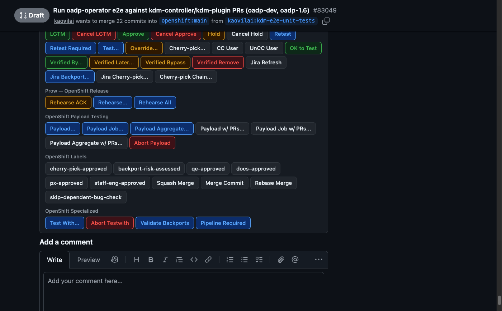
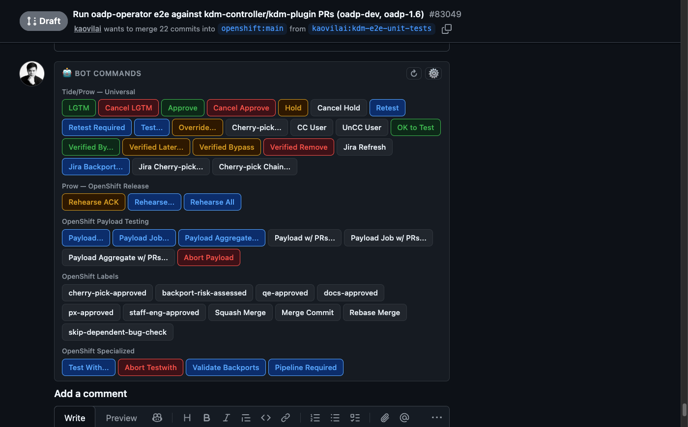
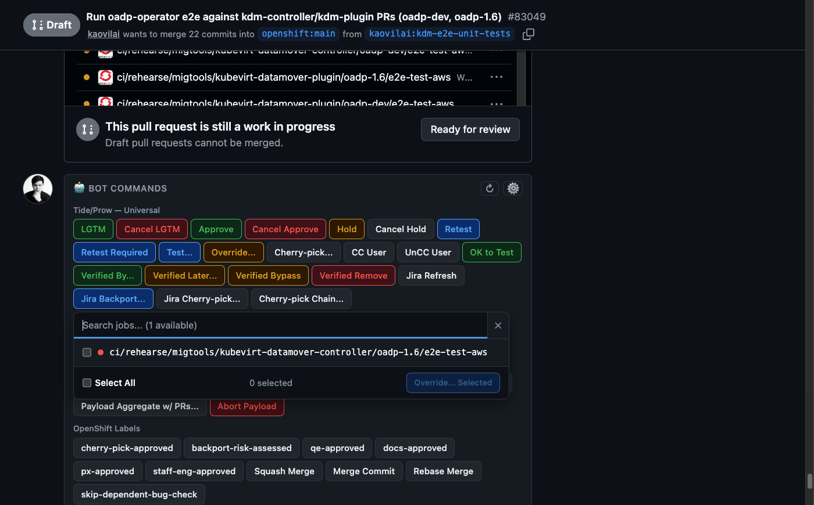
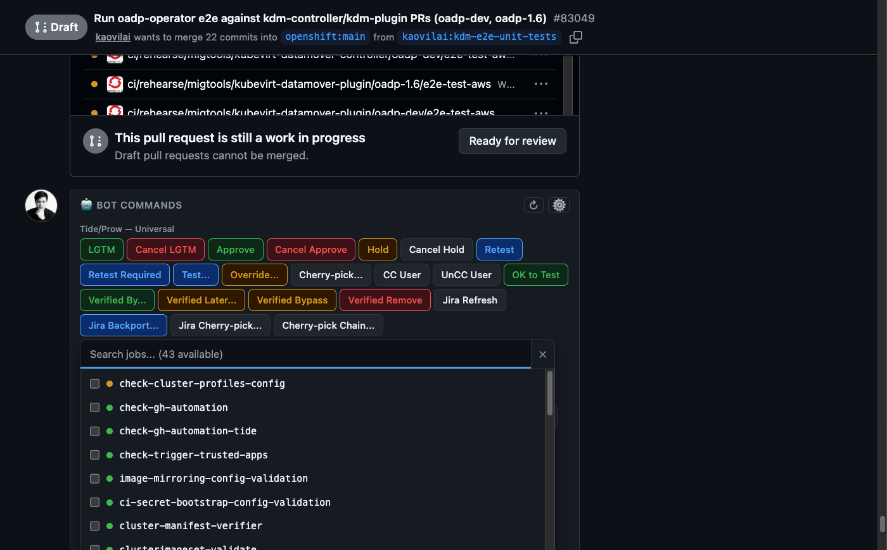
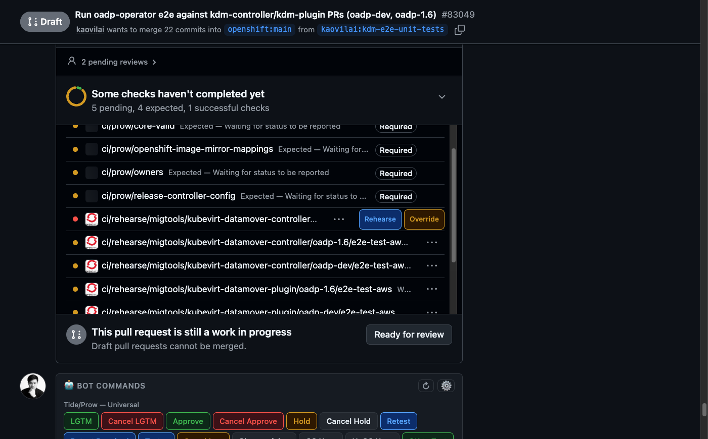
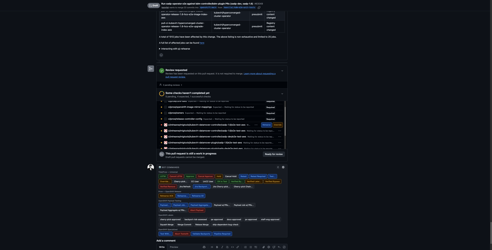
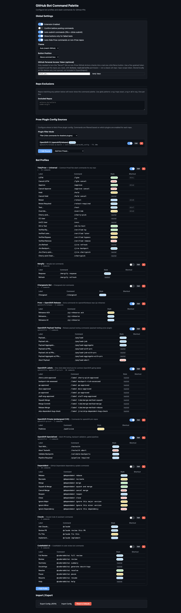
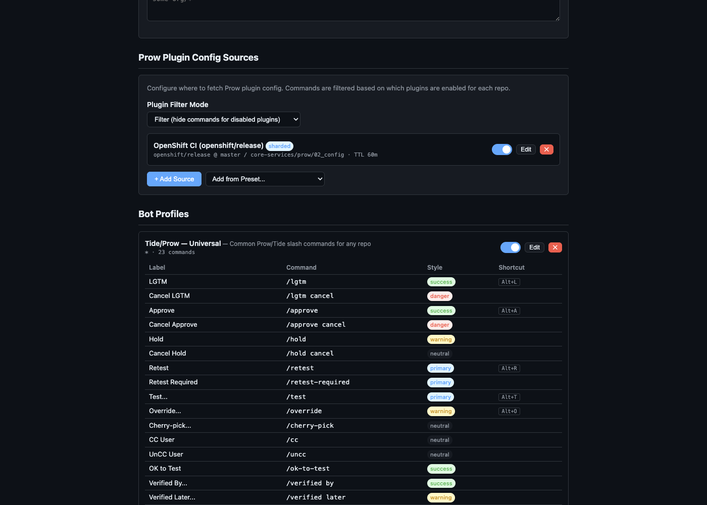

# GitHub Bot Command Palette

Chrome extension that injects contextual action buttons for CI/bot slash commands on GitHub PR pages.

## Screenshots

### Command Bar

One-click buttons for `/lgtm`, `/approve`, `/hold`, `/retest`, and more — injected above the GitHub comment box:



All buttons with keyboard shortcuts, color-coded by action type:



### Override & Test Job Picker

Click **Override...** or **Test...** to open a searchable picker showing all CI jobs from the PR — select multiple, then fire them at once:

**Override picker** (failing checks, multi-select):



**Test picker** (available presubmit jobs to retest):



### Failing CI Checks

Extension scrapes the Checks section to populate the job pickers, and injects
`Test`/`Override`/`Rehearse` buttons directly on each check row:



A pj-rehearse rehearsal check (`ci/rehearse/<org>/<repo>/<branch>/<job>`) isn't
`/test`-able, and its context can't be reliably reverse-engineered into the
real job name Prow needs (Prow builds the two independently). The extension
resolves the real name instead by fetching the target repo's own presubmit
config and matching Prow's own shortname algorithm — never guessing:



Not every check belongs to Prow — a repo can run plain GitHub Actions checks
(e.g. a workflow matrix job) that Prow has no knowledge of at all. Posting
`/test <name>` for one of those gets bounced ("target(s) not found"), no
matter how the name is spelled. The extension detects this per check and
adjusts what it offers:

- **Prow-owned check** — `/test` and `/override` buttons, as before.
- **GitHub Actions-native check** — no `/test` button (it can't work). Instead:
  a "Rerun?" link to the check's own Actions run page by default (GitHub's own
  "Re-run jobs" needs repo write access, so it may be greyed out there), or a
  real one-click **Rerun** button if a [GitHub token is configured](#github-actions-rerun-optional).
  `/override` is still offered — Prow's override plugin accepts any failed
  check run, not just ones it owns, so it remains the right way to unblock a
  Tide-blocked merge either way.

### Settings Page

Full profile management — enable/disable profiles, configure commands, set keyboard shortcuts:



Bot profile detail view with all commands, styles, and shortcuts:



---

## Installation

1. Clone or download this repository
2. Open `chrome://extensions/` in Chrome
3. Enable **Developer mode** (top right)
4. Click **Load unpacked** and select the `github-bot-command-palette` directory
5. Navigate to any GitHub PR page — command buttons appear above the comment box

## Features

- **Slash command buttons** — one-click `/lgtm`, `/approve`, `/retest`, `/hold`, etc.
- **Profile system** — configure commands per bot system (Prow, Mergify, Changesets, etc.)
- **Repo pattern matching** — glob patterns like `openshift/*` to scope profiles
- **Inline check buttons** — retest buttons next to failed CI checks
- **GitHub Actions rerun (optional)** — one-click rerun for checks Prow doesn't own, via a self-supplied token — see [below](#github-actions-rerun-optional)
- **Dynamic commands** — auto-generate buttons from failed check names (e.g., `/pj-rehearse <job-name>`)
- **Keyboard shortcuts** — Alt+L for LGTM, Alt+A for Approve, Alt+R for Retest, Alt+T for Test picker, Alt+O for Override picker
- **GitHub theme support** — matches light/dark mode automatically
- **SPA-aware** — works with GitHub's Turbo/PJAX navigation
- **Accessible** — ARIA labels on all injected buttons and dialogs; screen-reader-friendly

## Built-in Profiles

| Profile | Match Pattern | Commands |
|---------|--------------|----------|
| Tide/Prow — Universal | `*` (all repos) | `/lgtm`, `/lgtm cancel`, `/approve`, `/approve cancel`, `/hold`, `/hold cancel`, `/retest`, `/retest-required`, `/test …` (job picker), `/override …` (job picker), `/cherry-pick …` (branch picker), `/cc @user`, `/uncc @user`, `/ok-to-test`, `/verified by/later/bypass/remove`, `/jira refresh/backport/cherrypick`, `/cherrypick …` (serial chain, branch picker) |
| Prow — OpenShift Release | `openshift/release` | `/pj-rehearse ack`, `/pj-rehearse <tests>…` (job picker), `/pj-rehearse` (all) |
| OpenShift Payload Testing | `openshift/*` | `/payload`, `/payload-job`, `/payload-aggregate`, `/payload-with-prs`, `/payload-job-with-prs`, `/payload-aggregate-with-prs`, `/payload-abort` |
| OpenShift Labels | `openshift/*`, `openshift-priv/*` | `/label` shortcuts: `cherry-pick-approved`, `backport-risk-assessed`, `qe-approved`, `docs-approved`, `px-approved`, `staff-eng-approved`, `tide/merge-method-*`, `jira/skip-dependent-bug-check` |
| OpenShift Private (embargoed CVE) | `openshift-priv/*` | `/publicize` |
| OpenShift Specialized | `openshift/*` | `/testwith`, `/testwith abort`, `/validate-backports`, `/pipeline required` |
| Mergify | `*` (disabled by default) | `/mergify requeue`, `/mergify refresh` |
| Changesets Bot | `*` (disabled by default) | `/changeset <type>` |
| Dependabot | `*` (disabled by default) | `@dependabot rebase`, `@dependabot recreate`, `@dependabot merge`, `@dependabot squash and merge`, `@dependabot cancel merge`, `@dependabot reopen`, `@dependabot close`, `@dependabot ignore this major/minor version`, `@dependabot ignore this dependency` |
| Claude | `*` (disabled by default) | `@claude <instruction>` (free-form input), `@claude review this PR`, `@claude fix this`, `@claude implement …` |
| CodeRabbit AI | `*` (disabled by default) | `@coderabbitai full review`, `@coderabbitai review`, `@coderabbitai summary`, `@coderabbitai generate docstrings`, `@coderabbitai resolve`, `@coderabbitai pause`, `@coderabbitai resume`, `@coderabbitai help` |

## Adding a New Bot Profile

1. Click the extension icon → **Open Settings**
2. Scroll to **Bot Profiles** → click **+ Add Profile**
3. Fill in:
   - **Name** — display name
   - **Repo Patterns** — one glob pattern per line (e.g., `myorg/*`)
   - **Commands** — add global commands (always visible) and check commands (next to failed CI)
4. Click **Save**

## Per-Repo Overrides

In Settings → **Repo Overrides**, you can:
- Add extra profiles for a specific repo
- Disable profiles for a specific repo
- Add one-off commands for a specific repo

## GitHub Actions Rerun (optional)

Checks that are plain GitHub Actions jobs — not Prow ProwJobs — can't be
retriggered with `/test` (Prow doesn't own them, see [Failing CI
Checks](#failing-ci-checks)). Without any setup, the extension links to the
check's own Actions run page instead. To turn that into a real one-click
**Rerun** button:

1. Click the extension icon → **Open Settings**
2. Under **Global Settings**, paste a token into **GitHub Personal Access
   Token** — use a **fine-grained** token scoped to just the repos you need,
   with **Actions: read and write** permission only. A classic all-repo
   `repo`-scope token also works but is broader than necessary.
3. Click **Verify Token** to confirm it's valid before relying on it.

The token is stored in `chrome.storage.local` — device-scoped, never synced
across Chrome profiles, and not included in Export/Import. It's read by the
background service worker only when you click Rerun, to call GitHub's
documented `POST /repos/{owner}/{repo}/actions/jobs/{job_id}/rerun` API;
`/override` (which works with or without a token — see above) remains the way
to unblock a Tide-blocked merge on a check you can't rerun.

## Import / Export

- **Export**: Settings → Export Config (JSON) — downloads `ghbcp-config.json`
- **Import**: Settings → Import Config — upload a previously exported JSON file
- **Reset**: Settings → Reset to Defaults — restores built-in profiles

## Architecture

```
manifest.json          — Chrome Manifest V3 config
background.js          — Service worker: config fetch, plugin YAML parsing, presubmit job caching
config-manager.js      — Configuration CRUD, storage, glob matching
prow-plugin-map.js     — Static map of known Prow plugin commands
content.js             — Main injection: DOM manipulation, button rendering, SPA listeners
styles.css             — GitHub-themed styles (light/dark, responsive)
settings.html/js       — Full settings page (profiles, commands, import/export)
popup.html/js          — Toolbar popup (current repo, matched profiles)
icons/                 — Extension icons (16/48/128px)
config-export.json     — Sample config with all default profiles
vendor/                — Vendored third-party libraries (js-yaml)
tests/                 — Unit and integration tests
```

## Configuration Schema

See `config-export.json` for the full schema. Key types:

- **BotProfile** — name, repo patterns, global/check/dynamic commands
- **BotCommand** — label, command text, style, input support, keyboard shortcut
- **DynamicCommandRule** — JS expression evaluated with check context (testName, checkName)

The optional [GitHub token](#github-actions-rerun-optional) is *not* part of
this schema — it lives in its own `chrome.storage.local` key, separate from
the synced config blob, and is therefore excluded from Export/Import.

## Security

- No `eval()` — dynamic commands use `new Function()` with scoped variables only
- All user input sanitized before DOM insertion
- No network requests from the content script — it only talks to the background
  service worker (`chrome.runtime.sendMessage`), which makes all outbound calls
- All config lives in `chrome.storage.sync`, except the optional [GitHub
  token](#github-actions-rerun-optional), which lives in `chrome.storage.local`
  (device-scoped) precisely so it doesn't propagate to every Chrome profile
  signed into the same account
- The background service worker calls `api.github.com` with that token
  **only** when you click Rerun / Verify Token — never automatically, and
  never with any other origin
- Runs only on `https://github.com/*`
